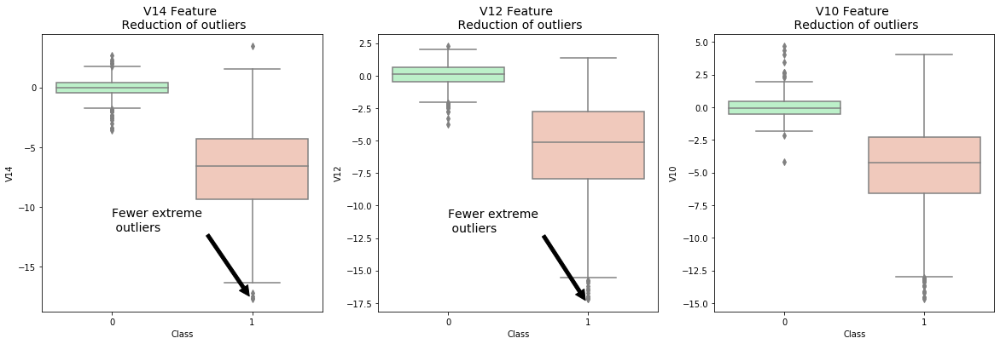

Today’s online payments experience is powered by dozens of unique tools — from payment gateways to fraud detection services
and checkout tools. In the enterprise ecommerce space, this approach is called “layering,” in which business layer on suites
of different tools to create “robust” payments and fraud detection stacks.

Machine Learning algorithms usually work best when the different classes contained in the dataset are more or less equally present.
If there are few cases of fraud, then there's little data to learn how to identify them. This is known as class imbalance,
and it's one of the main challenges of fraud detection.

We will do our study with The datasets contains transactions made by credit cards in September 2013 by european cardholders.
This dataset presents transactions that occurred in two days, where we have 492 frauds out of 284,807 transactions.
The dataset is highly unbalanced, the positive class (frauds) account for 0.172% of all transactions.

It contains only numerical input variables which are the result of a PCA transformation.
Unfortunately, due to confidentiality issues, the data cannot provide the original features and more background information about the data.
Features V1, V2, ... V28 are the principal components obtained with PCA, the only features which have not been transformed with PCA
are 'Time' and 'Amount'. Feature 'Time' contains the seconds elapsed between each transaction and the first transaction in the dataset.
The feature 'Amount' is the transaction Amount, this feature can be used for example-dependant cost-senstive learning.
Feature 'Class' is the response variable and it takes value 1 in case of fraud and 0 otherwise.

#### We going to build the model in top of pyspark built with hadoop google cloud clusters make sure you have spark installed in your remote clusters or your local machine. 

#### You can have alook at the link below which could helo you with installing pyspark on google cloud 

https://medium.com/@ankycheng/set-up-pyspark-environment-on-goolge-cloud-platform-853b629f1206


# Coding Part

first we should understand that the dataset is imbalanced with total 284807 records but only 492 fraud records. Which will make  it almost impossible to have a good model with such a small number of fraud records. So we will try to reduce the number of non-fraud records to make it something close to the fraud records 

### first we initialize the pysaprk and the required lab

```

import findspark
findspark.init('/home/sak/spark-2.4.3-bin-hadoop2.7')
import pyspark
from pyspark import SparkContext, SparkConf
conf = SparkConf().setAppName("sajad").setMaster("local")
sc = SparkContext(conf=conf)

from pyspark.sql import SparkSession
from pyspark.sql import SparkSession

spark = SparkSession \
    .builder \
    .appName("Python Spark SQL basic example") \
    .config("spark.some.config.option", "some-value") \
    .getOrCreate()


from pyspark.sql.functions import explode
from pyspark.sql.functions import split

```
Now we  read the creditcard file 
```
data_O = spark.read.load('creditcard.csv', 
                          format='csv', 
                          header='true', 
                          inferSchema='true')

type(data_O)
pyspark.sql.dataframe.DataFrame

```
To have better understanding with data we can check the number of fraud vs number of none-fraud

```
classFreq = data_O.groupBy("Class").count()
classFreq.show()

```

Now we convert the data to pandas type so we can easily play with some  parameters and at the same time we reduce the data to 50/50 
So we can escape from the imbalanced that exists in our data 

```
import pandas as pd
data= data_O.toPandas()
data= data.sample(frac=1)

# amount of fraud classes 492 rows.
fraud_df = data.loc[data['Class'] == 1]
non_fraud_df = data.loc[data['Class'] == 0][:492]

normal_distributed_df = pd.concat([fraud_df, non_fraud_df])

# Shuffle dataframe rows
new_df = normal_distributed_df.sample(frac=1, random_state=42)

new_df.shape

(984, 31)

```
We do some ploting to show the new data balance 

```
import seaborn as sns
from matplotlib import pyplot as plt

print('Distribution of the Classes in the subsample dataset')
print(new_df['Class'].value_counts()/len(new_df))
sns.countplot('Class', data=new_df)
plt.title('Equally Distributed Classes', fontsize=14)
plt.show()

```


Now after reduce that data we can check the important parameters that could effect our model. We can understand that using better visualization such as heatmap plots

```

# Make sure we use the subsample in our correlation

f, (ax1, ax2) = plt.subplots(2, 1, figsize=(24,20))

# Entire DataFrame
corr = data.corr()
sns.heatmap(corr, cmap='coolwarm_r', annot_kws={'size':20}, ax=ax1)
ax1.set_title("Imbalanced Correlation Matrix \n (don't use for reference)", fontsize=14)


sub_sample_corr = new_df.corr()
sns.heatmap(sub_sample_corr, cmap='coolwarm_r', annot_kws={'size':20}, ax=ax2)
ax2.set_title('SubSample Correlation Matrix \n (use for reference)', fontsize=14)
plt.show()

```


Now we can check the outliers of our parameters by using boxplots 

```
f, axes = plt.subplots(ncols=4, figsize=(20,4))

# Negative Correlations with our Class (The lower our feature value the more likely it will be a fraud transaction)
sns.boxplot(x="Class", y="V17", data=new_df,  ax=axes[0])
axes[0].set_title('V17 vs Class Negative Correlation')

sns.boxplot(x="Class", y="V14", data=new_df,  ax=axes[1])
axes[1].set_title('V14 vs Class Negative Correlation')


sns.boxplot(x="Class", y="V12", data=new_df, ax=axes[2])
axes[2].set_title('V12 vs Class Negative Correlation')


sns.boxplot(x="Class", y="V10", data=new_df, ax=axes[3])
axes[3].set_title('V10 vs Class Negative Correlation')

plt.show()

-----------------

f, axes = plt.subplots(ncols=4, figsize=(20,4))

# Positive correlations (The higher the feature the probability increases that it will be a fraud transaction)
sns.boxplot(x="Class", y="V11", data=new_df, palette=colors, ax=axes[0])
axes[0].set_title('V11 vs Class Positive Correlation')

sns.boxplot(x="Class", y="V4", data=new_df, palette=colors, ax=axes[1])
axes[1].set_title('V4 vs Class Positive Correlation')


sns.boxplot(x="Class", y="V2", data=new_df, palette=colors, ax=axes[2])
axes[2].set_title('V2 vs Class Positive Correlation')


sns.boxplot(x="Class", y="V19", data=new_df, palette=colors, ax=axes[3])
axes[3].set_title('V19 vs Class Positive Correlation')

plt.show()

```


```
from scipy.stats import norm

f, (ax1, ax2, ax3) = plt.subplots(1,3, figsize=(20, 6))

v14_fraud_dist = new_df['V14'].loc[new_df['Class'] == 1].values
sns.distplot(v14_fraud_dist,ax=ax1, fit=norm, color='#FB8861')
ax1.set_title('V14 Distribution \n (Fraud Transactions)', fontsize=14)

v12_fraud_dist = new_df['V12'].loc[new_df['Class'] == 1].values
sns.distplot(v12_fraud_dist,ax=ax2, fit=norm, color='#56F9BB')
ax2.set_title('V12 Distribution \n (Fraud Transactions)', fontsize=14)


v10_fraud_dist = new_df['V10'].loc[new_df['Class'] == 1].values
sns.distplot(v10_fraud_dist,ax=ax3, fit=norm, color='#C5B3F9')
ax3.set_title('V10 Distribution \n (Fraud Transactions)', fontsize=14)

plt.show()

```


Now after haveing better understaing of the parameters  outliers we can fix some of them (note I went through some of them only--however for better results you can do all of them) 
Note; you need to have numpy insallted in order to do the calculations 
For deep understanding in how to deal with outliers you can check the link below

https://machinelearningmastery.com/how-to-use-statistics-to-identify-outliers-in-data

```
import numpy as np

# # -----> V14 Removing Outliers (Highest Negative Correlated with Labels)
v14_fraud = new_df['V14'].loc[new_df['Class'] == 1].values
q25, q75 = np.percentile(v14_fraud, 25), np.percentile(v14_fraud, 75)
print('Quartile 25: {} | Quartile 75: {}'.format(q25, q75))
v14_iqr = q75 - q25
print('iqr: {}'.format(v14_iqr))

v14_cut_off = v14_iqr * 1.5
v14_lower, v14_upper = q25 - v14_cut_off, q75 + v14_cut_off
print('Cut Off: {}'.format(v14_cut_off))
print('V14 Lower: {}'.format(v14_lower))
print('V14 Upper: {}'.format(v14_upper))

outliers = [x for x in v14_fraud if x < v14_lower or x > v14_upper]
print('Feature V14 Outliers for Fraud Cases: {}'.format(len(outliers)))
print('V10 outliers:{}'.format(outliers))

new_df = new_df.drop(new_df[(new_df['V14'] > v14_upper) | (new_df['V14'] < v14_lower)].index)
print('----' * 44)


# -----> V12 removing outliers from fraud transactions
v12_fraud = new_df['V12'].loc[new_df['Class'] == 1].values
q25, q75 = np.percentile(v12_fraud, 25), np.percentile(v12_fraud, 75)
v12_iqr = q75 - q25

v12_cut_off = v12_iqr * 1.5
v12_lower, v12_upper = q25 - v12_cut_off, q75 + v12_cut_off
print('V12 Lower: {}'.format(v12_lower))
print('V12 Upper: {}'.format(v12_upper))
outliers = [x for x in v12_fraud if x < v12_lower or x > v12_upper]
print('V12 outliers: {}'.format(outliers))
print('Feature V12 Outliers for Fraud Cases: {}'.format(len(outliers)))
new_df = new_df.drop(new_df[(new_df['V12'] > v12_upper) | (new_df['V12'] < v12_lower)].index)
print('Number of Instances after outliers removal: {}'.format(len(new_df)))
print('----' * 44)


# Removing outliers V10 Feature
v10_fraud = new_df['V10'].loc[new_df['Class'] == 1].values
q25, q75 = np.percentile(v10_fraud, 25), np.percentile(v10_fraud, 75)
v10_iqr = q75 - q25


v10_cut_off = v10_iqr * 1.5
v10_lower, v10_upper = q25 - v10_cut_off, q75 + v10_cut_off
print('V10 Lower: {}'.format(v10_lower))
print('V10 Upper: {}'.format(v10_upper))
outliers = [x for x in v10_fraud if x < v10_lower or x > v10_upper]
print('V10 outliers: {}'.format(outliers))
print('Feature V10 Outliers for Fraud Cases: {}'.format(len(outliers)))
new_df = new_df.drop(new_df[(new_df['V10'] > v10_upper) | (new_df['V10'] < v10_lower)].index)
print('Number of Instances after outliers removal: {}'.format(len(new_df)))

```
Results will be something like 

```
Quartile 25: -9.692722964972385 | Quartile 75: -4.282820849486866
iqr: 5.409902115485519
Cut Off: 8.114853173228278
V14 Lower: -17.807576138200663
V14 Upper: 3.8320323237414122
Feature V14 Outliers for Fraud Cases: 4
V10 outliers:[-18.4937733551053, -18.8220867423816, -18.0499976898594, -19.2143254902614]
--------------------------------------------------------------------------------------------------------------------------------------------------------------------------------
V12 Lower: -17.3430371579634
V12 Upper: 5.776973384895937
V12 outliers: [-18.5536970096458, -18.6837146333443, -18.4311310279993, -18.0475965708216]
Feature V12 Outliers for Fraud Cases: 4
Number of Instances after outliers removal: 976
--------------------------------------------------------------------------------------------------------------------------------------------------------------------------------
V10 Lower: -14.89885463232024
V10 Upper: 4.92033495834214
V10 outliers: [-22.1870885620007, -15.1237521803455, -23.2282548357516, -24.4031849699728, -18.2711681738888, -15.3460988468775, -15.2318333653018, -22.1870885620007, -16.6011969664137, -16.2556117491401, -22.1870885620007, -15.5637913387301, -18.9132433348732, -20.9491915543611, -15.2399619587112, -15.5637913387301, -14.9246547735487, -16.3035376590131, -22.1870885620007, -16.7460441053944, -15.1241628144947, -19.836148851696, -24.5882624372475, -17.1415136412892, -15.2399619587112, -14.9246547735487, -16.6496281595399]
Feature V10 Outliers for Fraud Cases: 27
Number of Instances after outliers removal: 946

```
Now lets draw the outliers and see how our methodes worked 

```

f,(ax1, ax2, ax3) = plt.subplots(1, 3, figsize=(20,6))

colors = ['#B3F9C5', '#f9c5b3']
# Boxplots with outliers removed
# Feature V14
sns.boxplot(x="Class", y="V14", data=new_df,ax=ax1, palette=colors)
ax1.set_title("V14 Feature \n Reduction of outliers", fontsize=14)
ax1.annotate('Fewer extreme \n outliers', xy=(0.98, -17.5), xytext=(0, -12),
            arrowprops=dict(facecolor='black'),
            fontsize=14)

# Feature 12
sns.boxplot(x="Class", y="V12", data=new_df, ax=ax2, palette=colors)
ax2.set_title("V12 Feature \n Reduction of outliers", fontsize=14)
ax2.annotate('Fewer extreme \n outliers', xy=(0.98, -17.3), xytext=(0, -12),
            arrowprops=dict(facecolor='black'),
            fontsize=14)

# Feature V10
sns.boxplot(x="Class", y="V10", data=new_df, ax=ax3, palette=colors)
ax3.set_title("V10 Feature \n Reduction of outliers", fontsize=14)
ax3.annotate('Fewer extreme \n outliers', xy=(0.95, -16.5), xytext=(0, -12),
            arrowprops=dict(facecolor='black'),
            fontsize=14)


plt.show()

```


Now lets convert back the pandas to spark.sql data frame and add index to keep trace of the rows 

```
dfff = spark.createDataFrame(new_df)
from pyspark.sql.functions import *
from pyspark.sql.window import Window
win = Window().orderBy('Time')
dfff = dfff.withColumn("idx", row_number().over(win))

```
# Machine learning 

Now lets strat with machine learning. First we have to train our model in the new data 
we need to import some libraries first

```
from pyspark.ml import Pipeline
from pyspark.ml.classification import GBTClassifier
from pyspark.ml.feature import VectorIndexer, VectorAssembler
from pyspark.ml.evaluation import BinaryClassificationEvaluator
from pyspark.ml.linalg import DenseVector

```
Then we should divide the data to traning sets and test sets 

```
training_df = dfff.rdd.map(lambda x: (DenseVector(x[0:29]),x[30],x[31])) # Dense Vector required in spark to train the data
training_df = spark.createDataFrame(training_df,["features","label","index"])
training_df = training_df.select("index","features","label")
train_data, test_data = training_df.randomSplit([.8,.2],seed=1234)

```
we count the training and the testing data 

```
train_data.groupBy("label").count().show()
-----+-----+
|label|count|
+-----+-----+
|    0|  411|
|    1|  369|
+-----+-----+
&
test_data.groupBy("label").count().show()

+-----+-----+
|label|count|
+-----+-----+
|    0|   78|
|    1|   88|
+-----+-----+

```

Now we using Classifiers -- I am going to use GBTClassifier-- However you free to use any type of Classifiers such as LogisticR and other types and compare your results with the one found here.
```
gbt = GBTClassifier(featuresCol="features", maxIter=100,maxDepth=8)
model = gbt.fit(train_data)
predictions = model.transform(test_data)
predictions.groupBy("prediction").count().show()

+----------+-----+
|prediction|count|
+----------+-----+
|       0.0|   77|
|       1.0|   89|
+----------+-----+

```

```
evaluator = BinaryClassificationEvaluator()
evaluator.evaluate(predictions)
```
The results :

0.986451048951049

```
predictions = predictions.withColumn("fraudPrediction",when((predictions.label==1)&(predictions.prediction==1),1).otherwise(0))
predictions.groupBy("fraudPrediction").count().show()
+---------------+-----+
|fraudPrediction|count|
+---------------+-----+
|              1|   86|
|              0|   80|
+---------------+-----+
```

```
predictions.groupBy("label").count().show()

+-----+-----+
|label|count|
+-----+-----+
|    0|   78|
|    1|   88|
+-----+-----+

```

Number of fraud records identified = 96
Number of Total fraud records in test dataset = 116
Percentage of fraud records identified correctly (Accuracy to identify fraud) = 

----------------------------------------------------------------------------------------------------------------------------------------
```
from pyspark.sql.functions import col
accurateFraud = predictions.groupBy("fraudPrediction").count().where(predictions.fraudPrediction==1).head()[1]
totalFraud = predictions.groupBy("label").count().where(predictions.label==1).head()[1]
FraudPredictionAccuracy = (accurateFraud/totalFraud)*100
FraudPredictionAccuracy

The results of  Accuracy: 

97.72727272727273

```

----------------------------------------------------------------------------------------------------------------------------------------
Calculating Confusion matrix

```
tp = predictions[(predictions.label == 1) & (predictions.prediction == 1)].count()
tn = predictions[(predictions.label == 0) & (predictions.prediction == 0)].count()
fp = predictions[(predictions.label == 0) & (predictions.prediction == 1)].count()
fn = predictions[(predictions.label == 1) & (predictions.prediction == 0)].count()


print("True Positive: ",tp,"\nTrue Negative: ",tn,"\nFalse Positive: ",fp,"\nFalse Negative: ",fn)
print("Recall: ",tp/(tp+fn))
print("Precision: ", tp/(tp+fp))

```
##### True Positive:  86 
##### True Negative:  75 
##### False Positive:  3 
##### False Negative:  2
##### Recall:  0.9772727272727273
##### Precision:  0.9662921348314607


References:
Hands on Machine Learning with Scikit-Learn & TensorFlow by Aurélien Géron (O'Reilly). CopyRight 2017 Aurélien Géron
Machine Learning - Over-& Undersampling - Python/ Scikit/ Scikit-Imblearn by Coding-Maniac
auprc, 5-fold c-v, and resampling methods by Jeremy Lane
janio bachmann credit-fraud-dealing-with-imbalanced-datasets


